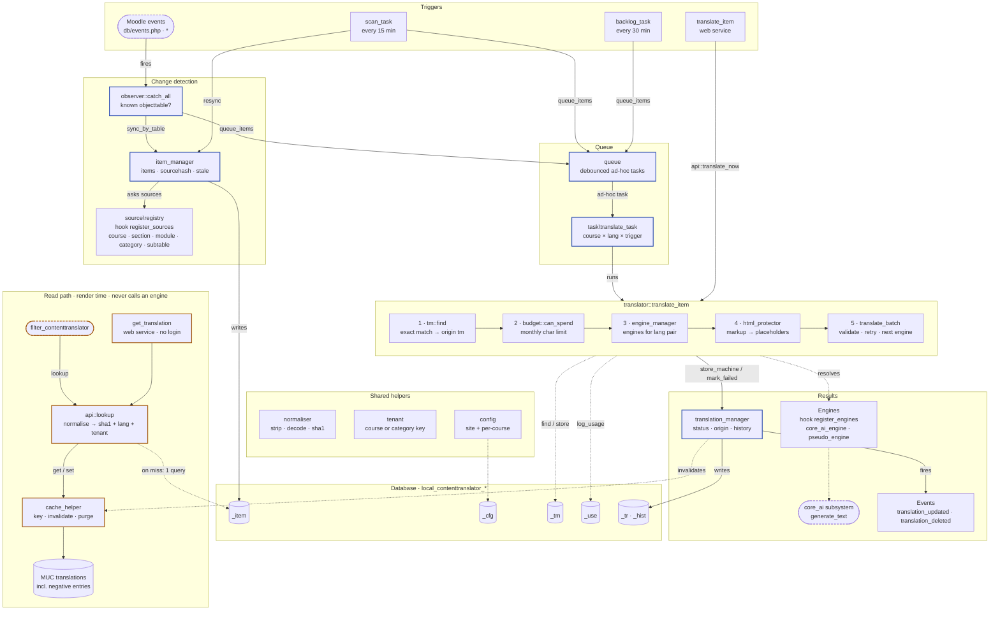

# Architecture

The plugin has two separate paths. The **write path** detects content changes and translates them in the
background. The **read path** serves stored translations at render time and never calls an engine.



Blue nodes are on the write path, orange nodes on the read path, dashed nodes live outside this plugin.
Dotted arrows are supporting calls. `save_translation` and `set_status` (not drawn) write straight to
`translation_manager`. Engines are resolved before any text is prepared: `html_protector` runs
inside the per-engine loop, only for engines that don't support HTML, so each fallback engine gets its own
protect → validate cycle.

## Registration points

| File | What it registers |
| --- | --- |
| `db/events.php` | One observer for every event (`*`), filtered by the tables of registered sources |
| `db/tasks.php` | `scan_task` every 15 min · `backlog_task` every 30 min · `cleanup_task` daily 03:20 (orphaned translations, old history) |
| `db/services.php` | `translate_item`, `save_translation`, `set_status`, `get_translation` |
| `db/caches.php` | `translations` (render lookups) · `courseconfig` |
| `db/messages.php` | `budget`: threshold alerts to site admins |
| `lib.php` | Course navigation entry and the `setup_check` status check |
| Pages | `index.php` dashboard · `edit.php` editor (uses `diff`) · `course.php` · `wizard.php` · `settings.php` |

## Core concepts

- **Item** = one translatable field, identified by `component`, `itemtype` (table), `field`, `itemid`,
  `contextid`, plus `sourcehash` (sha1 of the *normalised* source text) and `sourcelang`. Table
  `local_contenttranslator_item`.
- **Translation** = item × target language with `status`, `origin`, `locked`, engine/model, the source
  hash and snapshot it was made from, and an optional `suggestion`. Table `local_contenttranslator_tr`,
  history in `_hist`.
- **Normalisation** (`normaliser`): file references neutralised, tags stripped, entities decoded,
  whitespace collapsed. Raw DB content and cleaned, pluginfile-rewritten HTML therefore hash alike,
  which is what makes render-time lookups work without markup in the content.
- **Tenant** (`tenant`): key derived from course or category according to the site setting; scopes
  translation memory and render lookups.
- **Engines** (`engine\engine`): `translate_batch(segments, source, target, options)`. Engines that
  don't support HTML natively receive text whose markup and syntax were replaced by `<ph id="N"/>`
  placeholders (`html_protector`); the output is validated (each placeholder once, tag order kept),
  retried once with a stricter prompt, then handed to the fallback engine, then marked failed.
- **Budget** (`budget`): monthly site limit in characters, usage log `_use`, notifications.
- **Queue** (`queue`, `task\translate_task`): one ad-hoc task per (course, language, trigger);
  `reschedule_or_queue_adhoc_task` provides the debounce.

## Status lifecycle

```
missing → queued → machine → reviewed
             ↘ failed → queued (retry)
machine|reviewed → stale (source changed)
stale → machine   (was machine, not locked: re-translated)
stale → reviewed  (human accepts suggestion or keeps previous)
```

`translation_manager::is_overwritable()` is the single rule: locked, reviewed or human-origin
translations are never replaced; the pipeline stores a suggestion instead.

## Rendering

`api::lookup($text, $lang, $context)` computes the hash, reads the MUC cache
(`local_contenttranslator/translations`, key hash + language + tenant, negative entries included),
falls back to one DB query, picks the best candidate (same context first, reviewed before machine
before stale) and applies the visibility mode. The filter wraps the result with `lang`, badge and
banner. No engine is ever called during rendering.

## Change detection

- `observer::catch_all` listens to every event; if `objecttable` belongs to a registered source the
  record is re-synced (`course_modules` events are mapped to the module instance).
- `task\scan_task` re-syncs whole courses incrementally and removes items whose records disappeared.

## Backup and restore

`backup/moodle2/*` add items and translations at course, section and module level. Module-level rows
are buffered and written in `after_restore_module()` once the new activity id and the sub-table
mappings (`get_restore_mapping()`) exist. Course copy, import and activity duplication use the same
path.

## Events

`translation_updated`, `translation_deleted`, `bulk_started`, `budget_threshold_reached`
(namespace `local_contenttranslator\event`), usable by mod_booking rules and other observers.

## Extension points

- Hook `local_contenttranslator\hook\register_sources` → [Content source API](CONTENT_SOURCE_API.md)
- Hook `local_contenttranslator\hook\register_engines` → [Engine API](ENGINE_API.md)
- PHP API and web services → [PHP API and web services](PHP_API_AND_WEBSERVICES.md)
