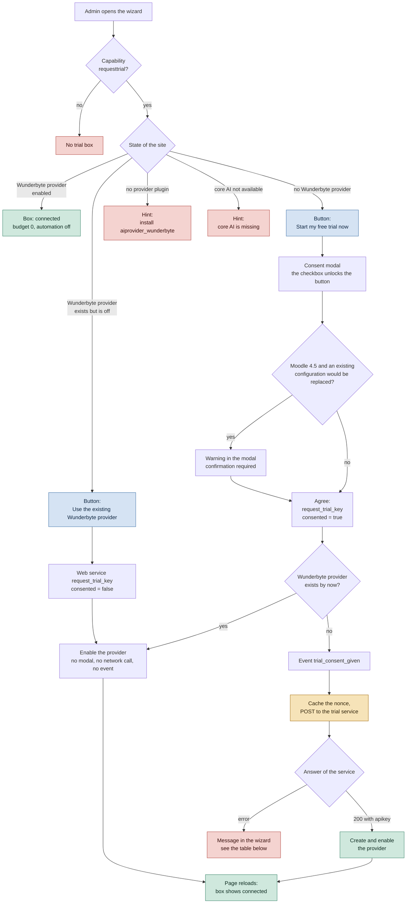
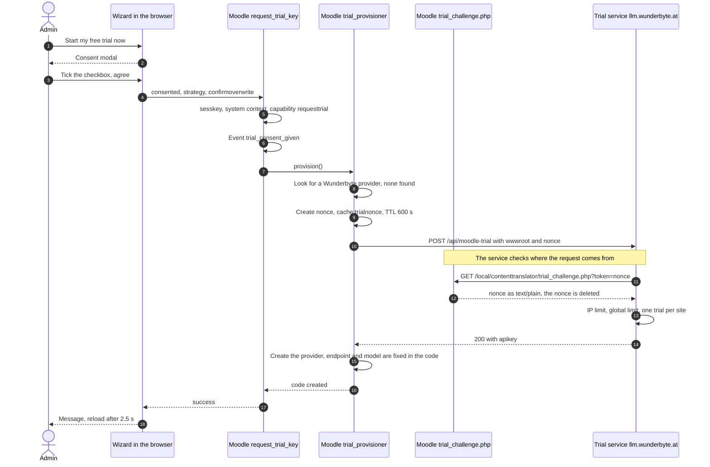

# Wunderbyte trial workflow

How the setup wizard starts the free Wunderbyte trial: what the wizard shows, what a click triggers, and how
the site and the trial service exchange the key. For the user view see
[Setup, section 8](../user/setup/README.md#8-free-wunderbyte-trial); for the web service see
[PHP API and web services](PHP_API_AND_WEBSERVICES.md).

Code: `classes/trial/trial_provisioner.php`, `classes/trial/provider_compat.php`,
`classes/external/request_trial_key.php`, `trial_challenge.php`, `amd/src/trial.js`.

## What the wizard shows and what a click triggers

The box needs the capability `local/contenttranslator:requesttrial`. Only the path through *Start my free trial
now* sends data to Wunderbyte.

Legend: blue = button in the wizard, yellow = call to `llm.wunderbyte.at`, green = provider ready,
red = hint or stop.

## Key exchange with the trial service

The service checks that the request really comes from the site: it calls the site back and expects the nonce
that was cached before the POST.

## Rules that shape the flow

- **Consent only for a new key.** An existing Wunderbyte provider is reused without modal and without event,
  because nothing is sent to Wunderbyte.
- **The nonce is single-use and valid for ten minutes.** It is cached before the POST; the challenge page
  deletes it on the first call.
- **The endpoint is fixed in the code.** The endpoint the service reports is ignored; the provider always points
  at `https://llm.wunderbyte.at/v1/chat/completions`.
- **One trial per site, shared credit.** All Wunderbyte plugins (booking agent, translator) use the same trial,
  so the wizard suggests budget 0 and automation off.
- **Moodle 4.5 overwrite protection.** There is one configuration per provider plugin; without confirmation the
  trial replaces nothing (code `needsconfirm`).
- **Reachability.** The site must be reachable from the internet over https, or the callback of the service fails.

## Result codes

`local_contenttranslator_request_trial_key` returns `success`, `message` and `code`.

| Code | Cause | Message to the admin |
|---|---|---|
| `created` | service answers 200 with a key | provider created and enabled |
| `reused` | a Wunderbyte provider exists | the existing provider is used, switched on if needed |
| `noconsent` | no provider yet, consent missing | no trial without consent |
| `needsconfirm` | Moodle 4.5, configuration would be replaced, not confirmed | confirm the overwrite |
| `noprovider` | no provider plugin installed | hint with a link to `aiprovider_wunderbyte` |
| `noconnection` | the server cannot reach the service | check firewall or proxy of the server |
| `unreachable` | 403 `origin_unverified` | Wunderbyte could not verify the site, shows the checked URL |
| `alreadyused` | 409 `already_issued` | the trial of the site is used up, with a buy link |
| `iplimit`, `globallimit`, `ratelimited` | 429, codes `ip_limit` and `global_limit` | limit reached, try later |
| `unavailable` | 503 | trial service temporarily unavailable |
| `failed` | 502 `upstream_failed`, 422 `invalid_request`, anything else | the trial could not be set up |
| `coreai` | core AI subsystem missing | Moodle AI is not available |
